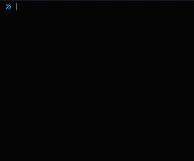

# Frontend logger

## Russian | [English](./README.md)



Логирование для фронтенда с возможностью использовать вместе с Sentry.

## Runbook

### Установка

```bash
npm i @anonymous-development-projects/js-logger
```

### Использование

Базовое использование:

```javascript
import Logger from '@anonymous-development-projects/js-logger';

const logger = new Logger();

// if you dont want showing messages in console
// const logger = new Logger(false); 

// errorHandler - handling from logger.error and logger.fatal
logger.setErrorHandler((error) => {
  // for example sending to Sentry
  // Sentry.captureException(error);
})

logger.removeErrorHandler();

logger.info('Info');
logger.debug('Debug', 'message');
logger.error(new Error('Error message')); // errorHandler will be executed if errorHandler is present
```

Методы:

```typescript
interface Logger {
  
    constructor(showOutput?: boolean); // show to console

    // you can use error handler for sending reports to sentry
    setErrorHandler(handler: (err: Error) => void): void;
    removeErrorHandler(): void;
    
    // logger methods
    error(...args: unknown[]): void;
    fatal(...args: unknown[]): void;
    fav(...args: unknown[]): void;
    info(...args: unknown[]): void;
    star(...args: unknown[]): void;
    success(...args: unknown[]): void;
    wait(...args: unknown[]): void;
    warn(...args: unknown[]): void;
    complete(...args: unknown[]): void;
    pending(...args: unknown[]): void;
    note(...args: unknown[]): void;
    start(...args: unknown[]): void;
    pause(...args: unknown[]): void;
    debug(...args: unknown[]): void;
    await(...args: unknown[]): void;
    watch(...args: unknown[]): void;
    log(...args: unknown[]): void;
}
```
